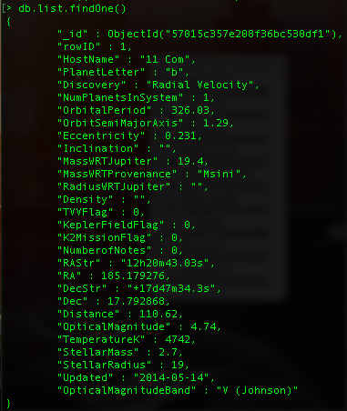
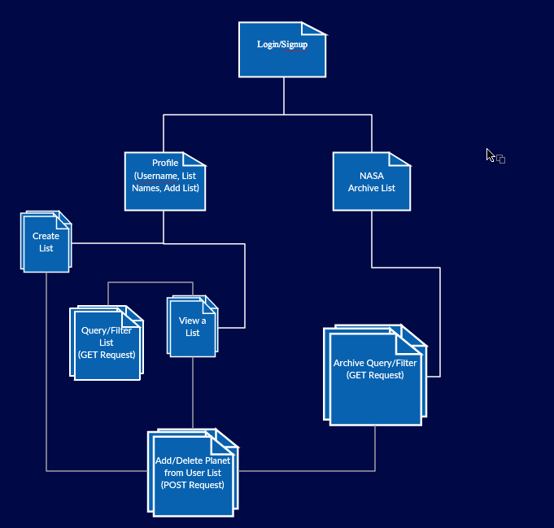

# Stargazer's Collection

## Overview

I'm personally obsessed with space; when I was younger, I'd love looking at planets and stars from a telescope in my backyard - why not make a web app that helps keep track of all your favorite exoplanet ?

A user can sign up and create a list of their favorite exoplanets by either entering their own information they've monitored or by querying an archive of ~ 2,000 confirmed exoplanets by NASA. If the user opts to enter their own information, the app will first crosscheck with the NASA archive to see if they're referencing a confirmed exoplanet, and will add the confirmed planet instead if there is a single match. If there's more than one match, the user can choose from the list of matching planets, or opt to make a new entry into their own observation list (the NASA archive won't be affected by this). This entry will be marked as a user exoplanet, rather than a confirmed NASA exoplanet.

Since many fields from the NASA archive are very difficult for regular observers to figure out without expensive equipment, I've kept only 8 fields as required (the rest will be there, but optional). These fields are the main criteria for matching a planet with the NASA archive:

* Planet Letter (D, H, J, K, L, M, N, T, Y)
* Number of Planets in System
* Orbital Period
* Distance
* Temperature
* Density
* Stellar Mass
* Stellar Radius

Note that this makes it difficult for a user to enter a ton of planets all at the same time (unless they make it up...) because these values take months (if not years) of observation to glean.


Based on this Confirmed Exoplanet Archive:

http://exoplanetarchive.ipac.caltech.edu/cgi-bin/TblView/nph-tblView?app=ExoTbls&config=planets


## Data Model

There will be 3 Mongoose schemas

1. User
  * Username/password
  * At minimum, there are 2 lists:
    * List of observed exoplanets in NASA archive
    * List of observed exoplanets not in NASA archive
  * User can add new lists and name them whatever they like
2. List
  * Associated User
  * Name
  * Date created
  * List of Exoplanets (see below)
3. Exoplanets - these are all taken from the NASA Archive
  * Host Name
  * Planet Letter **REQUIRED**
  * Discovery
  * Number of Planets in System **REQUIRED**
  * Orbital Period **REQUIRED**
  * Orbit on SemiMajor Axis
  * Eccentricity
  * Inclination
  * Mass wrt Jupiter
  * Mass wrt Provenance
  * Density **REQUIRED**
  * TVVFlag
  * Kepler Field Flag
  * K2 Mission Flag
  * Number of Notes
  * RA (String)
  * RA
  * Dec (String)
  * Dec
  * Distance **REQUIRED**
  * Optical Magnitude
  * Optical Magnitude Band
  * Temperature (Kelvin) **REQUIRED**
  * Stellar Mass **REQUIRED**
  * Stellar Radius **REQUIRED**
  * Last Update


First draft schema:

```javascript
// EXOPLANET

// An Exoplanet represents one object that a user can enter into
//on of their lists
//The below screenshot is an example of one of the exoplanets loaded from NASA's exoplanet archive
```

```javascript
//LIST
//A List has a name, date created, and holds exoplanet objects
var List = new mongoose.Schema({
  user: {type: mongoose.Schema.Types.ObjectId, ref:'User'},
  name: {type: String, required: true},
  created: {type: Date, required: true},
  planets: [exoplanet]
});


// USERS

// * our site requires authentication...
// * so users have a username and password (given by Facebook)
// * They start off with at least 2 lists of List objects
var User = {
  name: 'Radhika Mattoo',
  username: 'Given by FB',
  password: 'Given by FB',
  Lists: [{name: 'observedNASA', ...}, {name: 'observedSELF', ...}]
}
//User can add more lists if they want to
// EX: I want an additional list of all B-classified exoplanets in my profile, because they're my favorite
//So after I add the list, my object would look like this:
var User = {
  name: 'Radhika Mattoo',
  username: 'Given by FB',
  password: 'Given by FB',
  Lists: [{name: 'observedNASA', ...}, {name: 'observedSELF', ...}, {name:'BPlanets', ...}]
}


```

## Site Map



## Application Purpose

As a user, I want to search the NASA database of confirmed exoplanets
As a user, I want to add exoplanets I've observed, and see if they're new or already observed by NASA
As a user, I want to create my own unique list of exoplanets (for my own purposes)
As a user, as time goes by and I observe my exoplanet more, I want to update/change its information


## Research Topics


* (3 points) Integrate user authentication
    * I'm going to be using Passport for user authentication
    * Will do Facebook login/signup or regular email&password login/signup
* (2 points) Perform client side form validation using a JavaScript library
    * I'll be using Parsley http://parsleyjs.org/
* (1 point) Use a CSS framework throughout your site
    * Bootstrap!
